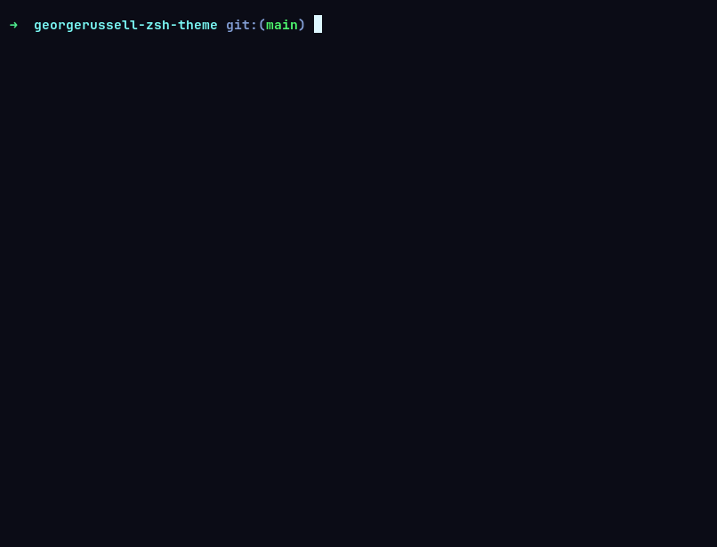
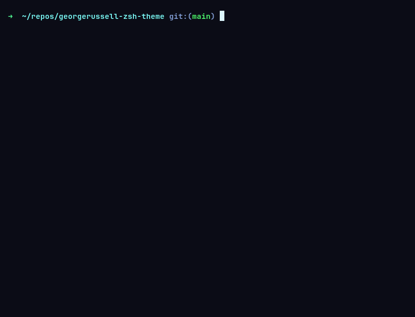

# georgerussell Oh-my-Zsh theme

An Oh My Zsh theme based on the `robbyrussell` theme.

## Wtf is it

I love the `robbyrussell` theme, but I wanted to see the full path to the current directory instead of just the last directory name.

So I created `georgerussell`: essentially `robbyrussell`, but with the full directory path.

## Why?

`robbyrussell` shows something like:



georgerussell shows:



That's pretty much it. :)

## How to install

Clone the repository into your Oh My Zsh custom themes directory:

```bash
git clone https://github.com/heliohsilva/georgerussell-zsh-theme.git /tmp/grussell-zsh-theme;
cp /tmp/grussell-zsh-theme/georgerussell.zsh-theme $ZSH_CUSTOM/custom/themes/georgerussell.zsh-theme
```

Then, edit your `~/.zshrc`:

```bash
nano ~/.zshrc
```

Find `ZSH_THEME` variable, and change its value to `georgerussell`

Finally, reload your shell:

```bash
source ~/.zshrc
```
That's it!

## License

MIT